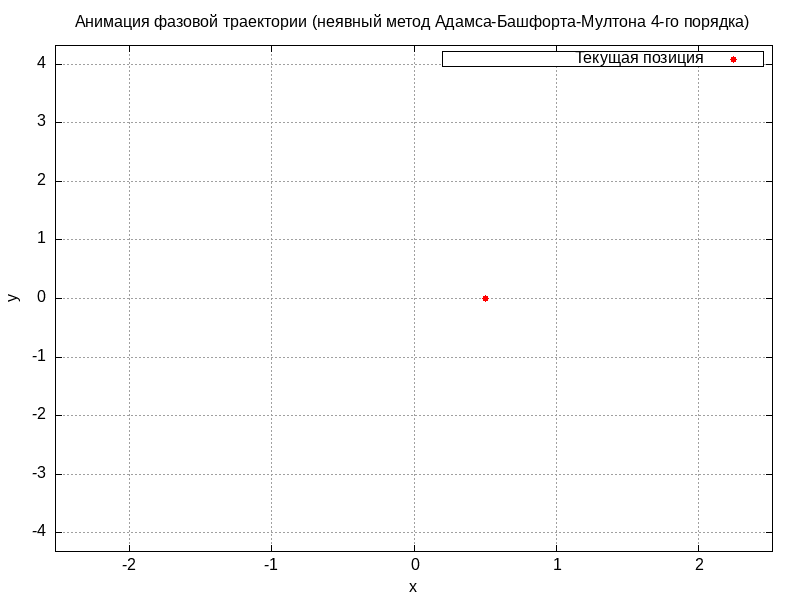
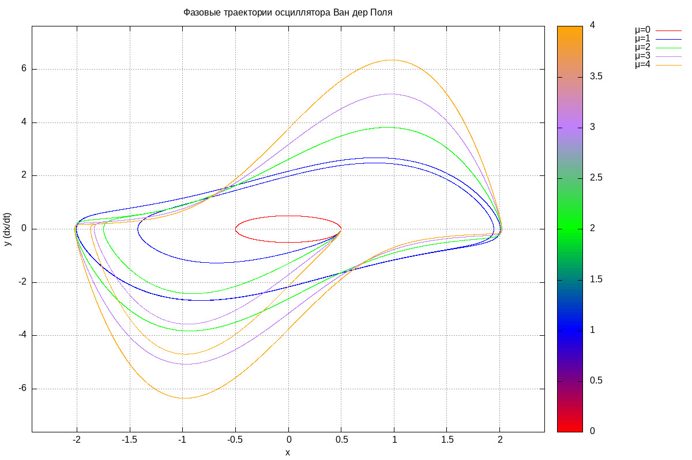

# Осциллятор Ван дер Поля 
Реализованные методы численного интегрирования:
* Метод Эйлера
* Метод средней точки
* Классический метод Рунге-Кутты 4 порядка
* Неявный метод средней точки
* Неявный метод трапеций
* Метод Адамса-Башфорта-Мултона 2 порядка
* Метод Адамса-Башфорта-Мултона 4 порядка
* Метод Хойна-Эйлера с адаптивным шагом 

Для запуска нужно установить Gnuplot и GD (для работы с GIF). Пример для Linux:
sudo apt-get install gnuplot libgd-dev

В папке gifs расположены анимированные графики фазовых траекторий и графики зависимости x от t для μ = 2 и h = 0.001 при применении разных методов численного интегрирования.

В папке images/ellipse расположены графики фазовых траекторий и графики зависимости x от t для μ = 0 и h = 0.001 при применении разных методов численного интегрирования.

В папке research располагается исследование

Пример фазовой траектории, полученной при применении метода Адамса-Башфорта-Мултона 4 порядка, μ = 2:

Пример фазовых траекторий, полученных при применении классического метода Рунге-Кутты 4 порядка для разных значений μ:
